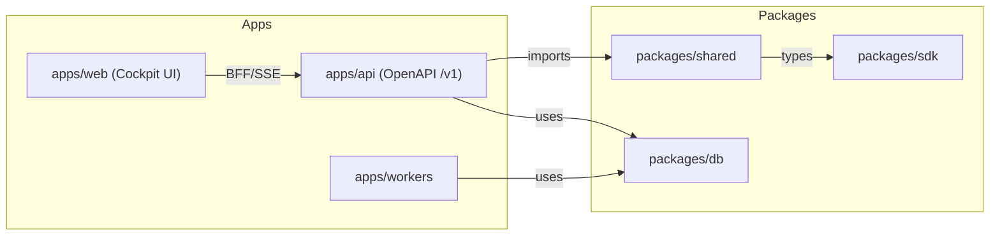

# ARCHITECTURE

Mermaid diagrama (alto nivel) y descripción de límites.

Límites clave:

- apps/* sólo deben importar packages/*
- packages/shared no debe importar apps/*

Ver `scripts/deps/check.mjs` (PR-3) para enforcement.
